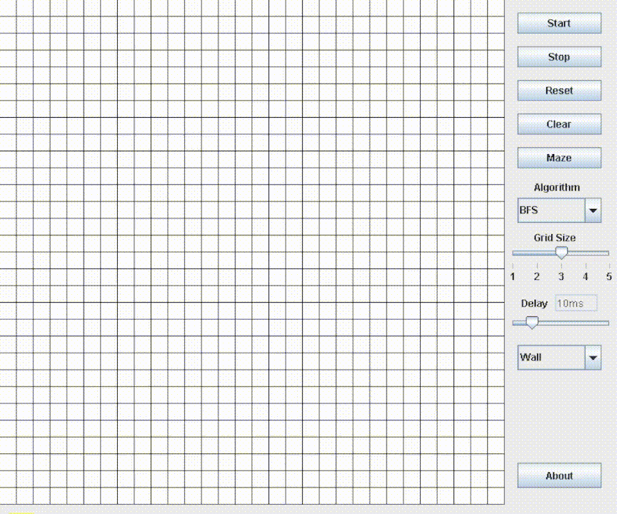

# Path Finding Visualizer

This is a Path Finding Visualizer which uses BFS(Breath First Search) algorithm for seaching shortest distance between two nodes.

This path Finding only uses BFS for searching and made from scratch , u can contact me if u find any issues

# COMPILE AND RUN THE MAIN FILE or SIMPLY COPY ALL FILE WITH THE SAME NAME AND RUN MAIN FILE 

Click on Download button -
[Download Path Visualizer](https://www.dropbox.com/s/a9dcwd2v8t9b0oh/PathFinding.jar?dl=0)

[Click here to learn what is BFS](https://www.geeksforgeeks.org/breadth-first-search-or-bfs-for-a-graph/)

## Screenshots

Demo 

 

## Color Reference

| Color             | Hex                                                                |
| ----------------- | ------------------------------------------------------------------ |
| Starting node - Blue |  #0000FF |
| Ending node - Cyan |  #00FFFF|
| Visited node - Green | #008000 |
| Visiting node - Red |  #FF0000 |
| Shortest Path - Yellow |  #FFFF00 |
| Not allowed to visit - Black |  #000000 |

## Features

- Start Button
- Stop Button 
- Reset Button - Resets all nodes
- Clear Button - Clear everything except starting and ending node 
- Wall Button - u can block the path by creating walls 
- Delay Slider - Change the value of delay
- Grid Slider - Change the number of grid 
- About Button - some info

## Optimizations

Code is not Optimized XD , as i said i made this from sratch and some basic things like Array , objects and some data structures like Stack and Queue

## Feedback

If you have any feedback, please reach out to us at AyushSharma014may@gmail.com

## About me 

Hii , this is Ayush Sharma , 2nd year from INDIA ,BIHAR ,BEHEA .
currently im pursing BTech CS from Vikrant University and still learning how to code well and how to make some crazy stuffs from code , thats all 

Thank u !!
